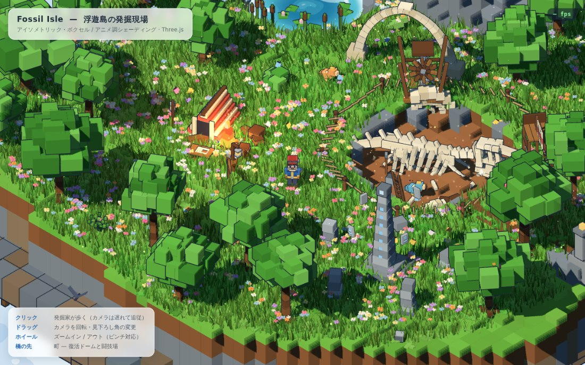
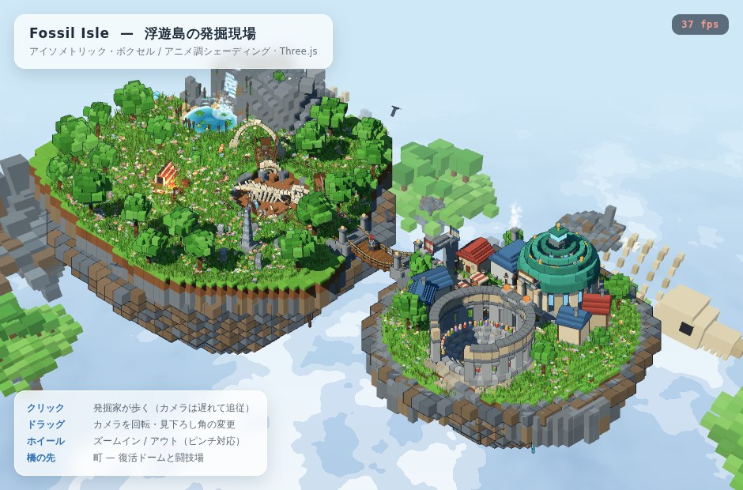
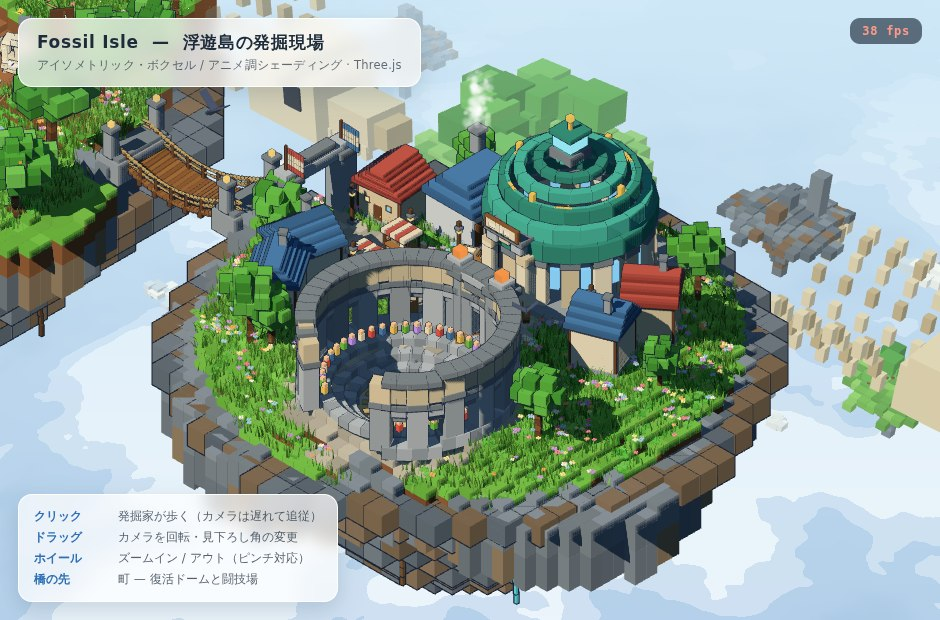
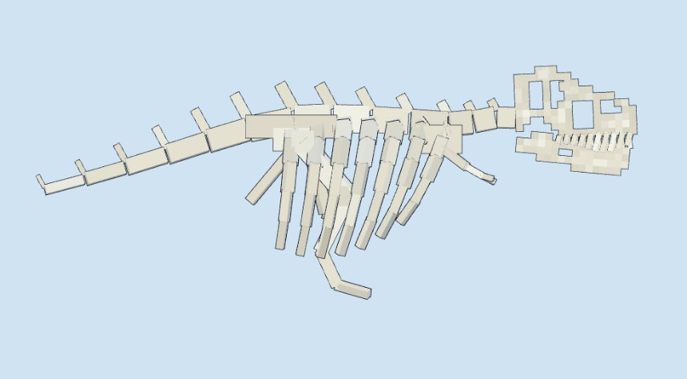
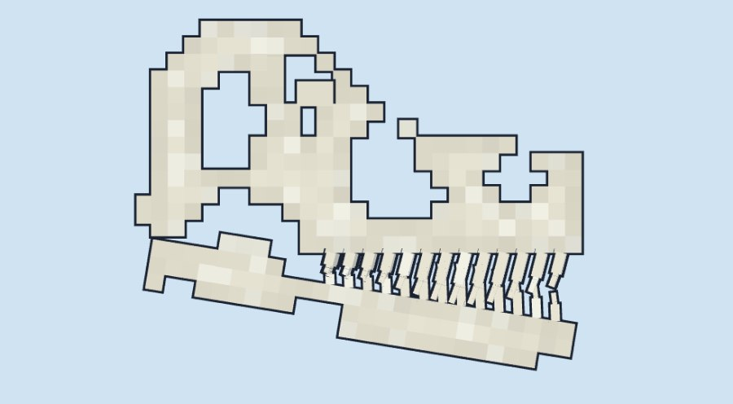

# Fossil Isle — 浮遊島の発掘現場

アイソメトリック・ボクセル + アニメ調シェーディングのグラフィックスデモ。
Three.js のみ（ローカル同梱）で動作し、**実行時のアセットダウンロードはゼロ**。
地形・キャラクター・草・化石・空、すべてブラウザ上で手続き的に生成しています。



<p align="center"></p>

<p align="center"></p>

<p align="center"><br>
</p>

## 動かす

ES Modules を使うため、ファイル直開き（`file://`）ではなく HTTP で配信します。

```bash
python3 -m http.server 8080
# → http://localhost:8080/index.html
```

### 単一 HTML に固める

配布用に、Three.js もコードも全部ひとつの HTML に入れたものを作れます
（約 0.6 MB、`file://` で直接開けます）。

```bash
npm i -D esbuild
node tools/build-standalone.mjs
# → dist/fossil-isle.html
```

## 操作

| 操作 | 動作 |
| --- | --- |
| クリック | 発掘家がその地点へ歩く（カメラは遅れて追従） |
| ドラッグ | カメラの方位・見下ろし角を変更 |
| ホイール / ピンチ | ズームイン・アウト |

歩けるのは発掘島の草原（半径 16）、吊り橋、そして町の島（半径 15）。
範囲外をクリックするとマーカーが赤くなり、境界までで止まります。
別の島をクリックすると、橋の両端を経由する経路を自動で辿ります。

## 世界

**発掘島** — 中央にティラノサウルスの発掘坑。キャンプ、池と滝、遺跡、
そして島の縁から雲の下へ落ちていく水。

**町（ホロウロック）** — 橋を渡った先の島が主人公の拠点。

- **復活ドーム** — 銅葺きのドーム。入口の奥で復活カプセルが青く脈動し、
  上空では黄金のリングがゆっくり回ります。西隣が化石のクリーニング工房で、
  作業台には半分だけ露出させた骨、煙突からは蒸気。掘る・磨く・よみがえらせるが
  ひとつ屋根の下。
- **コロシアム** — 石造りのアーチ列に囲まれた闘技場。地面を掘り下げた砂の
  フィールドに観客席が三段、その上に色とりどりの観客。門から砂場へは
  石段が下りていて、中まで歩いて入れます。
- ほかに噴水の広場、市の屋台、街灯、家並み、そして町の門。

## 技術メモ

**カメラ** — 真のアイソメトリック（`OrthographicCamera`、仰角 `atan(1/√2)`）。
正投影では遠近が出ず地平線も映らないため、背景（空・雲海・遠景の群島）だけを
**別シーン＋透視投影カメラ**で先に描き、深度をクリアしてから前景を重ねています。
背景カメラの画角は `2·atan(viewSize / distance)` でズームに追従させてあるので、
島と同じ距離のものはピタリと一致し、それより遠いものだけが小さくなります。

**セルシェーディング** — `MeshToonMaterial` + 手続き生成の 4 段グラデーションマップ。
輪郭線は反転ハル（`BackSide`）方式ですが、法線ではなくボクセル生成時に書き出した
`aExpand`（ボックス中心からの符号ベクトル）で押し出すため、箱の角に隙間が出ません。

**化石** — 骨は接線方向に回した箱を細らせながら繋いだテーパーロッド。
頭骨も同じで、**実物と同じように梁の組み合わせ**で作っています。
グリッドを穴で抜く方式だと、このブロックサイズではセル境界すべてに反転ハルの輪郭線が出て、
胴体の滑らかなロッドと線密度が合わず、頭だけ網目状に見えてしまうためです。
外形材（頭頂・鼻骨・前上顎骨・上顎骨・頬骨・方形骨）がシルエットを囲み、
3 本の支柱（後眼窩バー・涙骨・上顎骨上行突起）がその間を仕切ることで、
後ろから順に側頭窓・眼窩・前眼窩窓・外鼻孔が**骨と骨の隙間として自然に生まれます**。
脳函は奥に引っ込めてあるので、側頭窓は素通しではなく奥に何かが見える窓になります。

姿勢も種を決める要素なので、背骨は水平、腰を最高点に、短い首が頭を**前に**運び、
後肢は巨大で前肢は二本指の切り株、尾は長く壁の中へ消えていきます。
`tools/skull-profile.html` で頭骨単体（`?top` で上面）と全身（`?body`）を
正射影で確認できます。

**ボクセル生成** — `VoxelBuilder` が箱の集合を 1 つの `BufferGeometry` にマージ。
面ごとに焼き込んだ陰影、任意の回転行列、植生用の `aPivot`/`aSway` 属性に対応。
静物・草木・発光物はそれぞれ 1 メッシュにバッチされ、シーン全体で
描画コールは約 120、三角形は約 73 万（シャドウパス込み）に収まっています。

**風** — 草・花・シダ・樹冠・旗が 1 つのガスト場を共有。
頂点シェーダで曲げ、ゆっくり吹き抜ける突風の波、さらにキャラクターの周囲では
草がかき分けられます（`uPlayer`）。輪郭線用シェーダにも同じ変位を適用。

**水** — 池はセル調の帯とさざ波と岸の泡。滝は地形の高さを実際にサンプリングして
段差ごとに落水面を生成するカスケードで、稜線から池へ、池から島の縁へと流れ落ち、
最後は雲の下へ消えていきます（地形側にも水路を彫っています）。

**生きもの** — 蝶と鳥は羽ばたきを頂点シェーダで行う 1 ドローコールの
`InstancedMesh`。花粉・蛍・水しぶき・火の粉・粉塵は GPU 上で動く点群。
ほかに跳ねる化石ハッチリング、跳ねる魚、回るドリル、浮遊するルーン石、
揺れる焚き火の炎と光、流れる雲と日射しの明滅。

**60fps の維持** — フレーム時間を監視して、解像度スケール → 草の密度の順に
自動で品質を落とす（回復もする）5 段階のティアを持っています。右上に実測 fps。

## ソース構成

```
index.html
tools/skull-profile.html   頭骨・骨格の確認用ビュー（?top / ?body）
tools/build-standalone.mjs 単一 HTML へのバンドル
vendor/three/        Three.js r186（同梱、CDN 不要）
src/main.js          レンダラ・ライト・ループ・品質制御
src/camera.js        アイソメトリック操作（回転 / ズーム / 遅延追従）
src/character.js     発掘家のボクセルリグと歩行アニメーション
src/lib/voxel.js     ボクセルビルダー、トゥーンマテリアル、輪郭線
src/lib/wind.js      共有の風シェーダ
src/lib/math.js      乱数・ノイズ・補間
src/lib/parts.js     プロップ共通のローカル座標系とロッド
src/world/terrain.js 二つの島のハイトフィールド・地層・橋・歩行範囲
src/world/grass.js   草・花・シダのインスタンシング
src/world/props.js   化石・キャンプ・遺跡・道具・植生
src/world/town.js    町：復活ドーム・コロシアム・家並み・吊り橋
src/world/water.js   池・滝・カスケード
src/world/sky.js     空・雲海・遠景の群島
src/world/life.js    蝶・鳥・粒子・魚・小動物
```

ゲームプレイはまだありません。見て、回して、歩かせるためのデモです。
